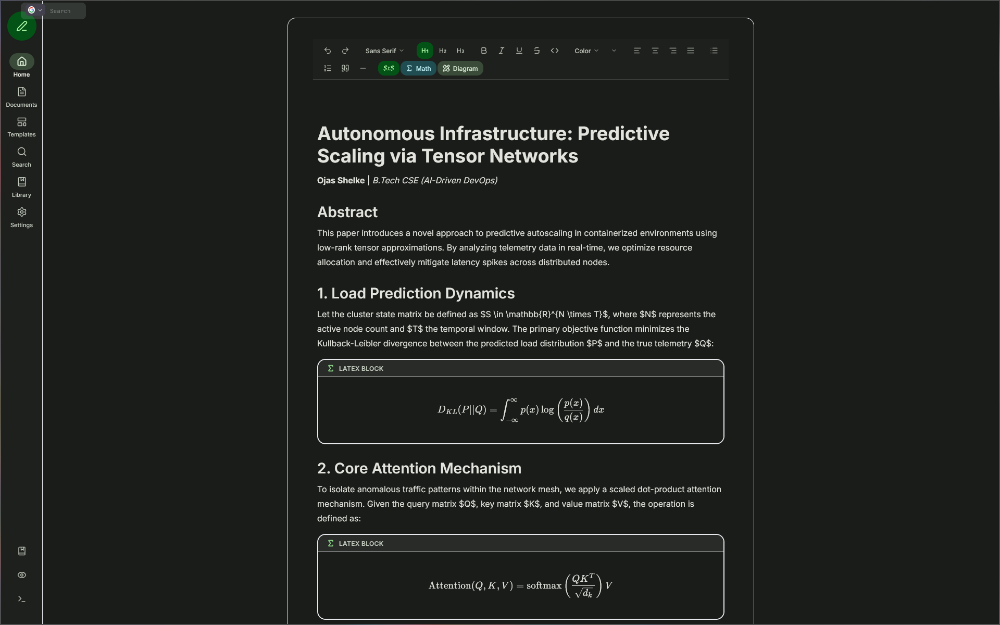
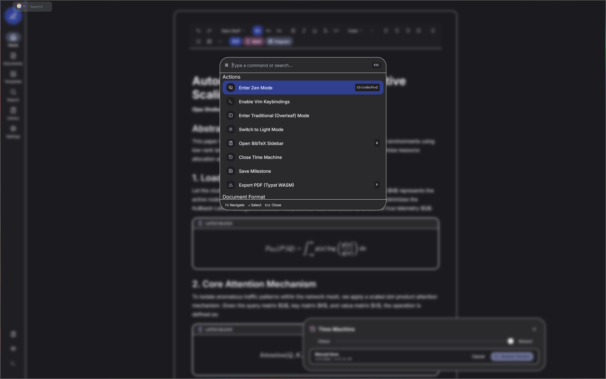
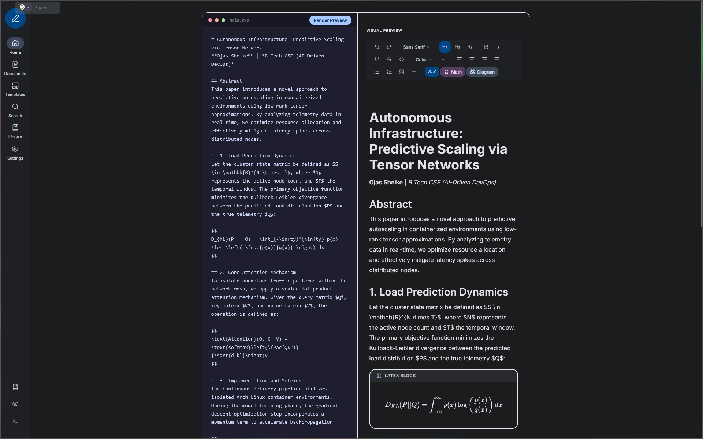
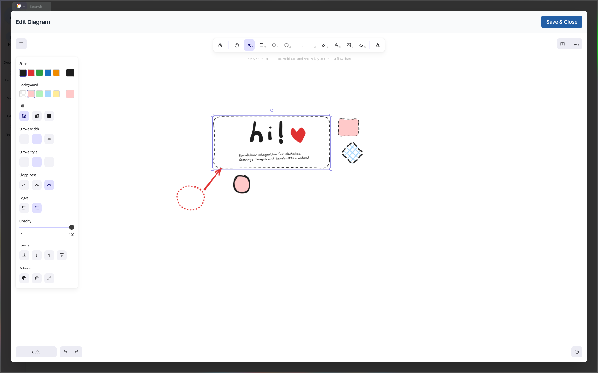
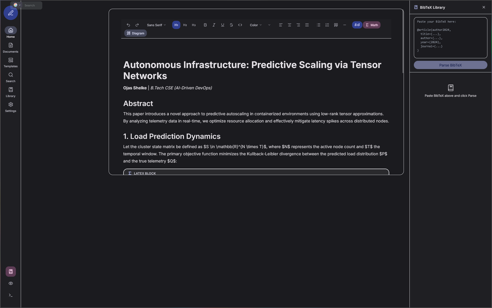
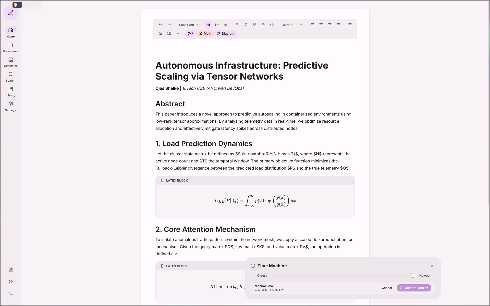

# Lemma

A local-first academic writing and diagramming environment. It merges the rich-text feel of modern note-taking apps with the rigorous typesetting power of LaTeX and Typst. Built entirely to run in the browser, Lemma requires no backend servers, databases, or API keys—your data never leaves your device.

**[Try the Live Demo!](https://lemma-editor.vercel.app)**



## Why I Built This

I wanted an editor that felt fluid to write in but didn't compromise on producing publication-ready academic documents. LaTeX editors like Overleaf are incredibly powerful, but they feel visually archaic and require constant server round-trips just to compile a PDF. On the flip side, standard WYSIWYG editors look great but completely fall apart when you need to write complex equations, manage citations, or render vector diagrams.

Lemma bridges that gap. It combines a custom Tiptap CRDT engine with a WebAssembly-powered Typst compiler to give you the best of both worlds.

## Features & Workflow

### 1. Local-First & Zero Latency
There are no loading spinners here. Powered by `localforage` (IndexedDB) and Yjs CRDTs, everything saves instantly to your local hardware. You can write, draw, and compile PDFs entirely offline.



### 2. The "Overleaf" Split-Pane Mode
Prefer writing raw code? Hit the command palette and toggle Traditional Mode. Write raw Markdown and Typst syntax on the left, and hit sync to instantly update the visual AST on the right. 



### 3. Infinite Canvas Integration
I integrated Excalidraw directly into the editor for seamless diagramming. Draw your system architectures or flowcharts, and they snap right into your document flow as clean SVGs.



### 4. Native BibTeX Support
Managing citations shouldn't require a third-party app. Lemma includes a built-in BibTeX library manager. Paste in your `.bib` references, and instantly search and inject citations directly into your text.
Also has support for 16:9 aspect ratio!



### 5. Git-Style Time Machine
Instead of a standard undo/redo stack that gets wiped out when you close the tab, Lemma takes immutable AST snapshots. Open the Time Machine to scrub back through your document's history and restore past versions.



## Under the Hood

Building this was an exercise in pushing browser limits and escaping standard server-side rendering patterns.

* **In-Browser Compilation:** Serverless functions usually have strict payload limits that break large binary compilers. Instead of relying on a backend, Lemma streams a Typst WebAssembly (WASM) compiler directly via CDN. It translates the Tiptap JSON AST into Typst source code and compiles the PDF locally in milliseconds.
* **React Portals for Canvas:** Because Tiptap (ProseMirror) aggressively manages DOM events, embedding a complex canvas inline usually breaks everything. I bypassed this by mounting the Excalidraw instance into an isolated React Portal modal, capturing the output, and saving it back to the editor state upon closure.
* **KaTeX Injection:** Custom Tiptap nodes safely intercept and render KaTeX formulas, preventing the ProseMirror sanitizer from destroying the raw HTML output.

## Tech Stack

* **Framework:** Next.js (App Router) + React
* **Editor:** Tiptap / ProseMirror + Yjs
* **Compiler:** Typst WebAssembly (`@myriaddreamin/typst-ts-web-compiler`)
* **Canvas:** Excalidraw
* **Storage:** LocalForage (IndexedDB)
* **Styling:** Tailwind CSS + Custom Material Design 3 Tokens

## Running Locally

Because Lemma is local-first, there's zero backend setup required.

```bash
# Clone the repository
git clone [https://github.com/Trapston3/lemma.git](https://github.com/Trapston3/lemma.git)
cd lemma

# Install dependencies (requires legacy-peer-deps for Tiptap core resolutions)
npm install --legacy-peer-deps

# Run the development server
npm run dev